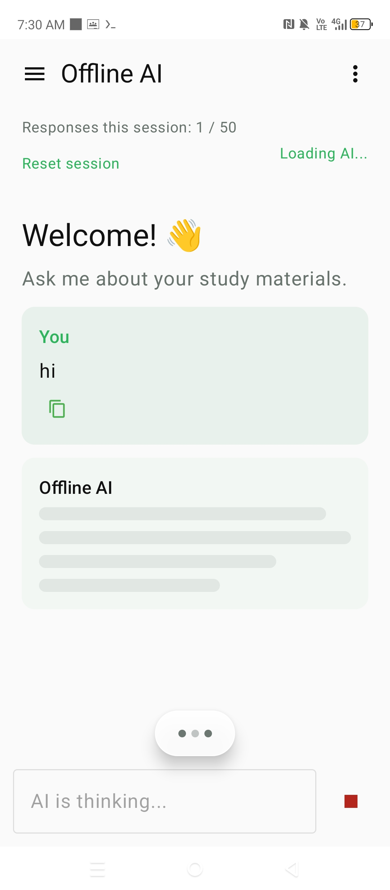
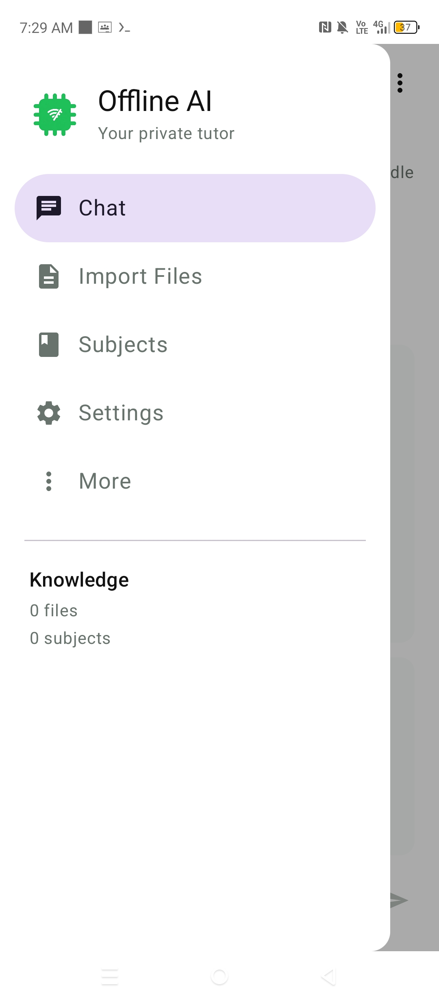
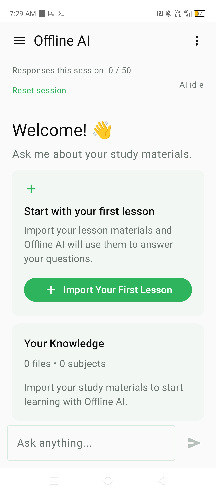
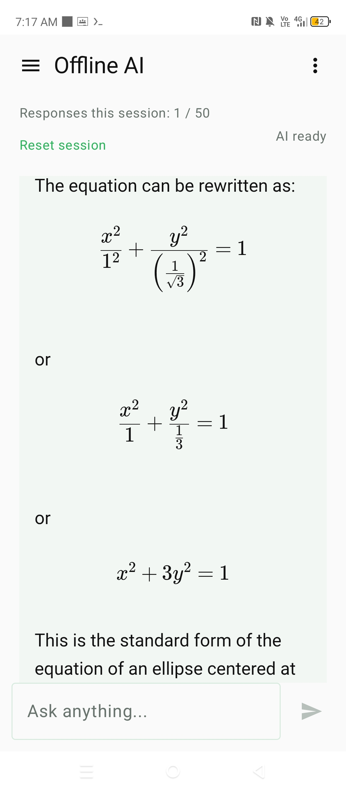
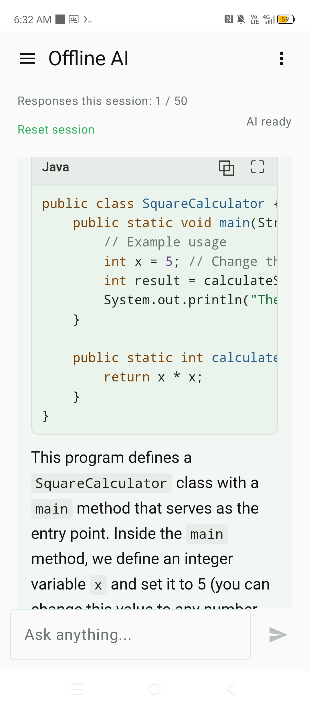
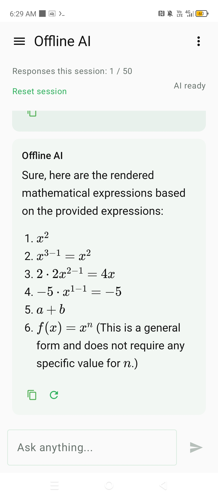

# Offline AI — Offline Study Assistant

> A personal Android AI study assistant that runs completely offline using a local language model. Built entirely on an Android phone with Termux and Vim — no cloud AI API or API key required.

[](https://kotlinlang.org/)
[](https://developer.android.com/compose)
[](https://github.com/ggml-org/llama.cpp)
[](https://huggingface.co/Qwen/Qwen2.5-1.5B-Instruct-GGUF)
[](https://github.com/chessTica542319/offline-ai)
[](LICENSE)

## Table of Contents

* [About](#about)
* [Why Offline AI](#why-offline-ai)
* [App Screenshots](#app-screenshots)
* [Current Status](#current-status)
* [Features](#features)
* [Supported Study Materials](#supported-study-materials)
* [Architecture](#architecture)
* [Tech Stack](#tech-stack)
* [Project Structure](#project-structure)
* [Getting Started](#getting-started)
* [Build Instructions](#build-instructions)
* [Local AI Model](#local-ai-model)
* [App Debugger](#app-debugger)
* [What Is Not Committed](#what-is-not-committed)
* [Current Limitations](#current-limitations)
* [Roadmap](#roadmap)
* [Contributing](#contributing)
* [Author](#author)
* [License](#license)

## About

Offline AI is an experimental Android study assistant designed to let students organize their learning materials and interact with them using an on-device language model.

The application is designed around an offline-first architecture:

* Study materials remain on the device.
* AI inference runs locally.
* No cloud AI API is required.
* No API key is required.
* The application is designed to work without an internet connection after setup.

The project is also a personal learning laboratory for Android development, Jetpack Compose, Room/SQLite, OCR, document processing, JNI, native C++, llama.cpp, and retrieval-augmented generation.

The entire application is being developed directly on an Android phone using Termux and Vim.

## Why Offline AI

### Privacy

Study materials stay on the device instead of being uploaded to a remote AI service.

### Offline Access

The application is designed for situations where internet access is unavailable, unreliable, expensive, or intentionally disabled.

### Phone-Only Development

This project demonstrates that a functional Android application with native AI inference can be developed directly from an Android phone.

## App Screenshots

The repository includes screenshots of the current Offline AI application.

### Loading Screen



### Navigation Drawer



### Chat Interface



### AI Response



### Code Response



### Rendered Mathematics



## Current Status

The core offline AI engine, local study knowledge system, retrieval pipeline, response renderer, and session controls are working.

### Completed

* [x] Android project setup
* [x] Jetpack Compose + Material 3 UI
* [x] Application navigation and navigation drawer
* [x] Chat interface
* [x] Temporary chat sessions
* [x] Temporary session memory
* [x] AI response counter with maximum 50-response session limit
* [x] Every AI attempt counted toward the session limit
* [x] Stop and interrupt AI generation
* [x] Retry AI responses
* [x] Copy AI responses
* [x] Session reset without deleting persistent study materials
* [x] Session-limit dialog with Cancel and Reset actions
* [x] Loading animation
* [x] AI thinking indicator
* [x] Response shimmer while AI is generating
* [x] Scroll-to-bottom behavior
* [x] Scroll-to-latest-response button
* [x] Local Room database
* [x] SQLite database
* [x] SQLite FTS4 full-text search
* [x] Subjects and lessons structure
* [x] Study content records
* [x] Individual study-content records for imported files
* [x] Original filename preservation
* [x] Editable study-content titles
* [x] File import workflow
* [x] Subject selection during import
* [x] Lesson organization
* [x] Document text extraction
* [x] Image OCR
* [x] OCR for imported images
* [x] Camera capture workflow
* [x] Local llama.cpp integration
* [x] JNI bridge between Kotlin and native C++
* [x] Persistent local AI model loading
* [x] Qwen2.5 1.5B Instruct GGUF integration
* [x] Q4_K_M quantized model support
* [x] ARM64 native libraries
* [x] Offline AI generation on Android
* [x] Local RAG retrieval
* [x] Retrieved study content supplied to AI context
* [x] Database migrations for the study knowledge database
* [x] Markdown-style response rendering
* [x] Mathematical expression rendering
* [x] Code block rendering
* [x] Syntax highlighting
* [x] Code copying
* [x] Full-screen code viewer
* [x] Consistent normal and full-screen code rendering
* [x] Local WebView response renderer
* [x] Custom application icon
* [x] Android APK builds directly from Termux
* [x] Local crash logging/debugger
* [x] Git repository and version-controlled source code

### Currently Being Developed

* [ ] Improved RAG relevance and context selection
* [ ] More accurate source and page citations
* [ ] Improved document-to-knowledge processing
* [ ] Better handling of long study materials
* [ ] Improved OCR for difficult or scanned documents
* [ ] Improved mathematical reasoning
* [ ] Native inference performance optimization
* [ ] Additional study-content management features
* [ ] More advanced offline study tools

## Features

### Chat

The main dashboard provides an offline chat interface for interacting with the local AI model.

Current chat features include:

* Local AI inference
* User and assistant message bubbles
* Temporary session memory
* Animated thinking indicator
* Response shimmer while generating
* Stop generation
* Retry response
* Copy response
* Temporary chat history
* Maximum 50 responses per session
* Session reset
* Automatic scrolling behavior
* Scroll-to-bottom control
* Mathematical response rendering
* Programming-code rendering
* Full-screen code viewing

Chat history is temporary and is not stored permanently in the study knowledge database.

### Subjects and Lessons

Study materials are organized using a hierarchy:

```text
Subject
└── Lesson
    └── Study Content
```

A subject can contain multiple lessons, and lessons can contain multiple study-content records.

Each imported file is treated as an individual study-content item rather than automatically merging multiple files.

The subject area is designed to behave similarly to an offline study file manager, where:

* Subjects act as major study categories.
* Lessons act as subcategories.
* Study content represents individual imported knowledge items.

### Study Content

Each imported file becomes an individual study-content record.

A study-content record can contain:

* Study title
* Extracted text
* Source type
* Original filename
* Creation date
* Lesson identifier

The original filename is kept separately from the editable study title.

For example:

```text
Original filename:
biology_week2.pdf

Study title:
Introduction to Body Systems
```

This allows users to give study materials meaningful titles without losing the original source filename.

### File Import

The application includes a local workflow for importing study materials into the knowledge database.

The intended workflow is:

```text
Select Files
      ↓
Choose or Create Subject
      ↓
Choose or Create Lesson
      ↓
Extract Text / OCR
      ↓
Review Imported Content
      ↓
Edit Study Information
      ↓
Save Study Content
      ↓
Local Knowledge Database
```

Imported files remain on the device.

### OCR

Images can be processed locally using on-device OCR.

OCR is intended to work with:

* Camera captures
* Imported image files
* Photographed study materials
* Image-based study materials
* Scanned academic material

The general workflow is:

```text
Image
   ↓
Local OCR
   ↓
Extracted Text
   ↓
Study Content
   ↓
Local Database
   ↓
RAG Retrieval
```

### Local RAG

Imported study materials can be searched locally and relevant content can be supplied to the local AI model as context.

The general workflow is:

```text
User Question
      ↓
Local Study Search
      ↓
Relevant Study Content
      ↓
Retrieved Context
      ↓
Local AI Model
      ↓
Answer
```

This allows the assistant to answer questions using the user's imported study materials while keeping the processing local.

### Mathematics

The chat renderer supports mathematical expressions.

Examples include:

```text
x^2
```

```text
y = x^2
```

```text
3x = 0
```

```text
x^2 + 3y^2 = 1
```

Mathematical expressions are rendered separately from normal conversational text to improve readability.

### Code Responses

Programming responses can be displayed using formatted code blocks with syntax highlighting.

The code interface supports:

* Language labels
* Syntax highlighting
* Horizontal scrolling
* Copy code
* Full-screen code viewing

### Full-Screen Code

A code block can be opened in a full-screen viewer.

The full-screen viewer provides:

* Back navigation
* Code language display
* Code copying
* Syntax highlighting
* Consistent styling with the normal chat renderer

### Session Reset

The session reset feature clears temporary chat information while preserving persistent study knowledge.

Resetting clears:

* Current conversation
* Temporary session memory
* Draft message
* Response count
* Scroll state
* Active generation

Resetting does not delete:

* Subjects
* Lessons
* Study content
* Imported study materials
* Persistent RAG knowledge

If the AI is currently generating a response, generation is stopped before the temporary session is cleared.

## Supported Study Materials

The application targets the following study and content formats:

```text
PDF
DOC
DOCX
TXT
RTF

JPG
JPEG
PNG
WEBP
HEIC

PPT
PPTX

XLS
XLSX
CSV
```

The application intentionally excludes executable, programming, web, and configuration-oriented formats from the supported study-material whitelist.

Examples of excluded formats include:

```text
HTML
JS
BASH
MARKDOWN
YML
```

The file-format restriction is intended to be enforced by the application's import and processing logic rather than only by the user interface.

## Architecture

The application follows an offline-first architecture:

```text
┌───────────────────────────────────┐
│         Jetpack Compose UI        │
├───────────────────────────────────┤
│          App Navigation           │
├───────────────────────────────────┤
│       Chat / Session Memory       │
├───────────────────────────────────┤
│        Study Repository           │
├───────────────────────────────────┤
│          Room / SQLite            │
│ Subjects / Lessons / Content      │
├───────────────────────────────────┤
│       SQLite FTS4 Search          │
├───────────────────────────────────┤
│     Document Extraction / OCR     │
├───────────────────────────────────┤
│          RAG Context              │
├───────────────────────────────────┤
│             AI / JNI              │
├───────────────────────────────────┤
│            llama.cpp              │
├───────────────────────────────────┤
│         Local GGUF Model          │
│           Qwen2.5 1.5B            │
└───────────────────────────────────┘
```

The local AI engine can load the model and generate responses directly on the Android device.

Imported study materials can be stored in the local knowledge database and retrieved when relevant to a user's question.

## Tech Stack

### Android

* Kotlin
* Jetpack Compose
* Material 3
* AndroidX
* Room
* SQLite

### Native AI

* C++
* JNI
* llama.cpp
* GGUF
* Qwen2.5 1.5B Instruct

### Study Knowledge

* Room Database
* SQLite
* SQLite FTS4
* Local retrieval
* Retrieval-Augmented Generation
* Local OCR
* Local document extraction

### Chat Rendering

* Android WebView
* HTML
* CSS
* JavaScript
* Marked
* KaTeX
* highlight.js

### Development Environment

* Android phone
* Termux
* Vim
* OpenJDK
* Clang
* CMake
* Android SDK
* Android NDK
* Gradle Wrapper
* Git

## Project Structure

```text
offline-ai/
├── app/
│   ├── libs/
│   │   └── poi-on-android.jar
│   ├── schemas/
│   └── src/main/
│       ├── assets/
│       │   ├── chat_renderer.html
│       │   ├── chat_renderer.css
│       │   ├── chat_renderer.js
│       │   ├── chat_math.js
│       │   ├── chat_math_fit.js
│       │   ├── chat_fullscreen_renderer.html
│       │   ├── chat_fullscreen_renderer.js
│       │   ├── marked.min.js
│       │   ├── katex.min.js
│       │   ├── katex.min.css
│       │   ├── auto-render.min.js
│       │   └── highlight.min.js
│       ├── cpp/
│       ├── java/
│       │   └── com/offlineai/app/
│       │       ├── ai/
│       │       ├── data/
│       │       │   ├── database/
│       │       ├── extraction/
│       │       ├── ocr/
│       │       └── repository/
│       │       ├── debug/
│       │       └── ui/
│       │           ├── camera/
│       │           ├── chat/
│       │           ├── components/
│       │           ├── importfiles/
│       │           ├── navigation/
│       │           ├── splash/
│       │           ├── subjects/
│       │           └── theme/
│       ├── jniLibs/
│       │   └── arm64-v8a/
│       └── res/
├── docs/
│   └── screenshots/
│       ├── offlineai_loading.jpg
│       ├── offlineai_slidebar.jpg
│       ├── offlineai_chat.jpg
│       ├── offlineai_chatresponse.jpg
│       ├── offlineai_chatcoderesponse.jpg
│       └── offlineai_renderedmath.jpg
├── gradle/
├── gradle.properties
├── gradlew
├── gradlew.bat
├── build.gradle.kts
├── settings.gradle.kts
├── README.md
└── .gitignore
```

Generated build directories and large local model files are intentionally excluded from version control.

## Getting Started

### Requirements

The project is primarily developed and tested on:

* Android 14+
* ARM64 / `arm64-v8a`
* Termux
* OpenJDK 21+
* Android SDK
* Android NDK
* Git
* Gradle Wrapper

Clone the repository:

```bash
git clone https://github.com/chessTica542319/offline-ai.git
cd offline-ai
```

Make the Gradle wrapper executable:

```bash
chmod +x gradlew
```

## Build Instructions

Build the debug APK:

```bash
./gradlew assembleDebug
```

The generated APK will be located at:

```text
app/build/outputs/apk/debug/app-debug.apk
```

For a clean build:

```bash
./gradlew clean
./gradlew assembleDebug
```

If a compatible Android installation environment is available:

```bash
./gradlew installDebug
```

The project also contains native C++ components used by the local AI engine.

## Local AI Model

Offline AI uses a local GGUF language model through llama.cpp.

Current development model:

```text
Model: Qwen2.5 1.5B Instruct
Quantization: Q4_K_M
Format: GGUF
Architecture: Qwen2
Context Size: 2048
```

The model file is approximately 1.12 GB.

The model is distributed separately and is intentionally not committed to this repository because of its size.

The model is used locally during development and Android application builds.

The model is stored locally at:

```text
models/qwen2.5-1.5b-instruct-q4_k_m.gguf
```

For Android packaging during development, the model is copied into:

```text
app/src/main/assets/models/
```

The large GGUF model file is excluded from Git using `.gitignore`.

Official model repository:

[https://huggingface.co/Qwen/Qwen2.5-1.5B-Instruct-GGUF](https://huggingface.co/Qwen/Qwen2.5-1.5B-Instruct-GGUF)

## App Debugger

Offline AI includes a local crash debugger designed for situations where ADB or Logcat may not be available on the development device.

The debugger uses a local crash logger that installs an uncaught-exception handler when the application starts.

When an uncaught application crash occurs, Offline AI attempts to create a crash report in the device's shared Download directory.

The expected location is:

```text
Download/
└── Offline AI/
    └── crash.txt
```

The crash report can contain:

```text
Offline AI Crash Report
=======================
Time
Thread
Android version
Android API level
Device manufacturer
Device model
Exception stack trace
```

This allows the developer to inspect a crash directly from the Android device without depending on ADB or Logcat.

### Crash Report Behavior

The debugger does not create `crash.txt` during normal application use.

The file is created when an uncaught application exception is handled by the crash logger.

If the application does not crash, the `Offline AI` debugger folder may not contain `crash.txt`.

The application attempts to save the report using Android's `MediaStore.Downloads` system.

The crash report is stored under:

```text
Download/Offline AI/crash.txt
```

### Debugger Purpose

The debugger is intended to help diagnose:

* Application crashes
* Runtime exceptions
* Unexpected native or Kotlin failures
* Device-specific problems
* Errors that are difficult to inspect without ADB
* Problems encountered during phone-only development

The debugger is especially useful for the project's Termux-based development workflow because the application is developed and tested directly on an Android phone.

## What Is Not Committed

Large generated or machine-specific files are excluded from the repository.

Examples include:

```text
build/
app/build/
native-build/
.gradle/
.idea/
local.properties
*.apk
*.aab
models/
*.gguf
```

The local Qwen GGUF model is intentionally excluded because of its size.

Native Android libraries currently used by the application are kept under:

```text
app/src/main/jniLibs/arm64-v8a/
```

These libraries are part of the current Android build checkpoint.

## Current Limitations

This project is still a work in progress.

The current system already connects imported study knowledge with local retrieval and AI generation.

Current architecture:

```text
Imported Files
      ↓
Extraction / OCR
      ↓
Room / SQLite
      ↓
SQLite FTS4 Search
      ↓
Relevant Study Content
      ↓
RAG Context
      ↓
Local Qwen Model
      ↓
Answer
```

Current limitations include:

* The local Qwen2.5 1.5B model has limited reasoning compared with larger models.
* Generated answers may contain factual or mathematical mistakes.
* Retrieval accuracy depends on the quality and structure of imported study materials.
* OCR accuracy depends on image quality, text clarity, and document layout.
* Complex document layouts may require additional processing.
* Long documents require further improvements to chunking and context selection.
* Source and page citations are still being improved.
* Native inference performance can still be optimized.
* Advanced embedding-based retrieval is not yet implemented.
* Handwriting recognition is not yet implemented.
* Chat attachments are planned for a future version.
* Photo-based mathematical problem solving is planned for a future version.

## Roadmap

### Completed Foundation

```text
Android Project
      ↓
Jetpack Compose UI
      ↓
Navigation
      ↓
Chat Interface
      ↓
Subjects / Lessons
      ↓
File Import
      ↓
Document Extraction
      ↓
OCR
      ↓
Room / SQLite
      ↓
SQLite FTS4
      ↓
Local RAG
      ↓
llama.cpp
      ↓
Qwen GGUF
      ↓
Offline AI Generation
      ↓
Formatted AI Responses
      ↓
Mathematical Rendering
      ↓
Code Rendering
      ↓
Temporary Session Memory
      ↓
50-Response Session Limit
      ↓
Session Reset
      ↓
Local Crash Debugger
      ↓
Offline Chat
```

### Current Development

* [x] Local AI generation
* [x] Local study knowledge
* [x] Local retrieval
* [x] RAG-connected chat
* [x] Temporary session memory
* [x] 50-response session limit
* [x] Session reset
* [x] Math rendering
* [x] Code rendering
* [x] Full-screen code viewer
* [x] OCR and camera workflow
* [x] Crash debugger
* [ ] Improve retrieval relevance
* [ ] Improve source and page citations
* [ ] Improve long-document context selection
* [ ] Improve OCR quality
* [ ] Optimize native inference performance

### Future Upgrades

* [ ] Add a `+` button to the chat input
* [ ] Image attachments inside chat
* [ ] Document attachments inside chat
* [ ] File attachments inside chat
* [ ] Process attachments locally
* [ ] Use attached files as temporary chat context
* [ ] Photo-based mathematical problem solving
* [ ] Better mathematical OCR
* [ ] Scanned-PDF OCR improvements
* [ ] Handwriting recognition
* [ ] Embedding-based retrieval
* [ ] Hybrid FTS4/embedding retrieval
* [ ] Better RAG ranking
* [ ] Page-level citations
* [ ] Source references such as filename and page
* [ ] Additional local GGUF model options
* [ ] Model management
* [ ] Improved document processing
* [ ] Improved spreadsheet processing
* [ ] Improved presentation processing
* [ ] More advanced offline study tools
* [ ] Further UI refinement
* [ ] Performance and memory optimization

## Contributing

This is primarily a personal learning and hobby project.

Suggestions, issues, experiments, and pull requests are welcome.

For larger changes, consider opening an issue first to discuss the proposed architecture or implementation.

## Author

**RudaDev / Sam Ruda**

Bachelor of Science in Information Technology (BSIT)

**Iloilo State University of Fisheries Science and Technology — San Enrique Campus**

This project is being developed as a personal and academic technology project while studying at ISUFST San Enrique Campus.

### University

[https://isufst.edu.ph/](https://isufst.edu.ph/)

### San Enrique Campus

[https://isufst.edu.ph/san-enrique-campus-academic-programs/](https://isufst.edu.ph/san-enrique-campus-academic-programs/)

### Campus Map

[https://www.google.com/maps/search/?api=1&query=Iloilo+State+University+of+Fisheries+Science+and+Technology+San+Enrique+Campus](https://www.google.com/maps/search/?api=1&query=Iloilo+State+University+of+Fisheries+Science+and+Technology+San+Enrique+Campus)

### GitHub

[https://github.com/chessTica542319](https://github.com/chessTica542319)

### Offline AI Repository

[https://github.com/chessTica542319/offline-ai](https://github.com/chessTica542319/offline-ai)

### Portfolio

[https://ruda-dev.vercel.app](https://ruda-dev.vercel.app)

## License

Copyright (c) 2026 RudaDev / Sam Ruda.

This project is licensed under the MIT License.

See the `LICENSE` file for the complete license text.

The project also includes or uses third-party software and libraries that remain subject to their own licenses.

### Third-Party Rendering Components

#### Marked

Used for Markdown parsing and rendering.

Repository:

[https://github.com/markedjs/marked](https://github.com/markedjs/marked)

#### KaTeX

Used for mathematical expression rendering.

Repository:

[https://github.com/KaTeX/KaTeX](https://github.com/KaTeX/KaTeX)

KaTeX is distributed under the MIT License.

#### highlight.js

Used for programming-language syntax highlighting.

Repository:

[https://github.com/highlightjs/highlight.js](https://github.com/highlightjs/highlight.js)

highlight.js is distributed under the BSD 3-Clause License.

The Offline AI project does not claim ownership of these third-party components.

Their respective copyright notices and license requirements remain applicable.

